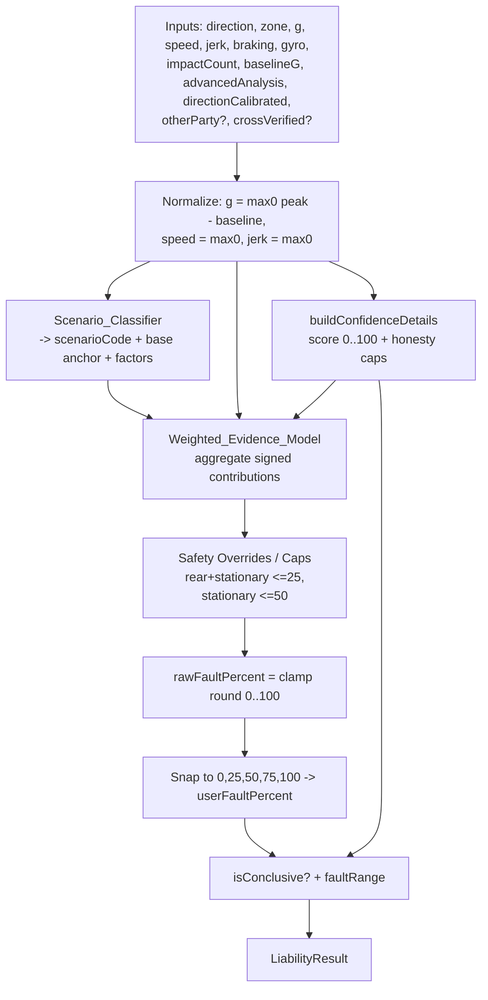

# Design Document — Liability Engine Enhancement (Axis 2 + Axis 3)

## Overview

هذه الوثيقة تصف تصميم تطوير محرك تقدير المسؤولية `calculateLiability` في
`artifacts/strix/lib/liabilityEngine.ts` لتغطية محورين متّفق عليهما من المتطلبات:

- **Axis 2 — Weighted Evidence Model:** استبدال منطق النِسب الأولية الثابتة
  (`analyzeRear/analyzeFront/analyzeSide/...` التي تُرجع قيمة `fault` مُصنّفة يدوياً)
  بنموذج **ترجيح أدلّة (weighted evidence aggregation)** يُنتج `rawFaultPercent`
  متدرّجاً (عدد صحيح 0–100) من مجموع **مساهمات مرجّحة (weighted contributions)** لعدة
  إشارات: منطقة/اتجاه الصدمة، السرعة، سياق المرور (Traffic Context)، سلوك الطرف الآخر
  (Other Party)، الجيروسكوب، الفرملة، أحداث ما قبل/بعد الصدمة (Advanced Analysis)،
  والتحقق المتبادل (Cross Verification). ثم يُقرّب الناتج (**snap**) إلى سلّم نجم
  القانوني `{0, 25, 50, 75, 100}` ويُنتج نطاق ثقة `faultRange`.

- **Axis 3 — New Scenarios:** إضافة ستة سيناريوهات جديدة إلى `Scenario_Classifier`:
  التقاطع بأولوية المرور (intersection right-of-way)، الاندماج في مسار (lane merge)،
  الانعطاف الكامل (U-turn)، الوقوف والمناورة (parking / maneuvering)، الاصطدام المتسلسل
  (chain collision)، وفتح الباب (door-opening) — كلٌّ بـ `scenarioCode` فريد وعنوان
  عربي وخلاصة `plainSummaryAr` وعوامل `factorsAr`، بنفس بنية السيناريوهات الحالية.

المبدأ التصميمي الحاكم: يبقى `calculateLiability` **دالة نقية حتمية (pure,
deterministic)** — بلا حالة عامة قابلة للتعديل، بلا `Date.now()`/زمن جدار، وبلا
`Math.random()` — كي يكون قابلاً لاختبار الخصائص عبر `fast-check`. ويظل التقدير
**استشارياً (advisory)** مع بقاء التنويه.

### Design Goals

1. **التوافق الخلفي (Backward Compatibility):** بقاء توقيع `calculateLiability`
   الحالي صالحاً، وبقاء بنية `LiabilityResult` كاملة، بحيث تعمل `SessionContext.tsx`
   وشاشات التقرير و`pdfExport.ts` و`croquisGenerator.ts` دون تعديل.
2. **الشفافية (Transparency):** إظهار `rawFaultPercent` (خام) و`userFaultPercent`
   (مُقرَّب) و`faultRange` (نطاق) معاً.
3. **الصدق (Honesty):** عدم ادّعاء ثقة عالية أو نتيجة قاطعة عند اتجاه مجهول أو غير
   معاير.
4. **قابلية الاختبار (Testability):** نقاء الدالة يجعل الخصائص P1–P12 قابلة للتحقق
   الآلي.

### Key Design Decision — إزالة العشوائية من توليد العوامل (Determinism Fix)

اكتُشف أثناء الدراسة أن `DynamicText` في `dynamicTextGenerator.ts` يعتمد على
`getRandomPhrase()` التي تستدعي `Math.random()`. هذا يخالف **Requirement 14.2**
(«SHALL NOT read random values») ويجعل `factorsAr` و`scenarioAr` (النصوص) غير حتمية.

القرار: يُستبدل الاختيار العشوائي بـ **اختيار حتمي (deterministic selection)** —
دالة `pickPhrase(phrases, seed)` تختار العبارة عبر `seed % phrases.length`، حيث
`seed` مُشتق حتمياً من المدخلات (مثل تجزئة `direction|zone|round(g)|round(speed)`).
بهذا تصبح كل مخرجات الدالة — بما فيها النصوص — حتمية دون فقدان التنوّع اللغوي بين
حالات مختلفة. (ملاحظة: **P3/Req 14.1** يشترط تطابق الحقول الرقمية والرمزية المُعدّدة
فقط؛ لكن جعل النصوص حتمية أيضاً يُرضي **Req 14.2** بشكل قاطع ويبسّط الاختبار.)

## Architecture

### High-Level Flow

المحرك يبقى دالة واحدة عامة `calculateLiability(...)`، لكن جسمها الداخلي يُعاد تنظيمه
إلى ثلاث طبقات نقية: **Scenario_Classifier** → **Weighted_Evidence_Model** →
**Snap & Range**. كل الطبقات دوال خالصة تأخذ مدخلاتها كوسائط ولا تقرأ حالة خارجية.



### Layered Responsibility

| Layer | Function(s) | Purity | Responsibility |
|-------|-------------|--------|----------------|
| Normalization | inline في `calculateLiability` | pure | تعويض baseline، قصّ السالب |
| Confidence | `buildConfidenceDetails` | pure | حساب score 0–100 + honesty caps + monotonic في g |
| Scenario_Classifier | `classifyScenario` (جديد يلفّ المحلّلات الحالية + الجديدة) | pure | تحديد `scenarioCode`, العنوان, العوامل, و **base anchor** |
| Weighted_Evidence_Model | `computeRawFault` (جديد) | pure | تجميع المساهمات المرجّحة + دمج cross/other-party + caps |
| Snap & Range | inline | pure | التقريب للسلّم + حساب `faultRange` و`isConclusive` |

> ملاحظة تصميمية: تُبقى أسماء المحلّلات الحالية (`analyzeRear` …) لكن يُعاد صياغتها
> لتُرجع **مساهمات (contributions)** بدل رقم نهائي، أو — كخيار أقل مخاطرة — تبقى
> كما هي وتُرجع `base anchor`، ثم يطبّق `computeRawFault` بقية المساهمات المرجّحة
> فوقها. التصميم يعتمد الخيار الثاني للحفاظ على سلوك السيناريوهات الحالية المُغطّاة
> باختبارات موجودة (Req 13.4).

### Purity & Determinism Strategy

- كل الوسائط تُمرَّر صراحةً؛ لا قراءة من `THRESHOLDS` إلا كقراءة ثوابت للقراءة فقط
  (read-only) — والمحرك لا يعدّلها.
- لا استخدام `Date.now()` أو `Math.random()` داخل مسار الحساب.
- `crossVerified` و`otherParty` يُعاملان **read-only** (تُقرأ حقولهما فقط، لا يُطفَّر
  عليهما) — Req 6.5.
- توليد النصوص عبر `pickPhrase(seed)` الحتمية (انظر أعلاه).

## Components and Interfaces

### 1. Public Signature (Backward-Compatible)

يبقى التوقيع الحالي كما هو، مع **إضافة وسيطين اختياريين في النهاية فقط** (بقيم
افتراضية) كي تستمر كل الاستدعاءات الحالية في الترجمة دون تعديل (Req 2.5):

```ts
export function calculateLiability(
  direction: ImpactDirection,
  peakGForce: number,
  speedKmh: number,
  jerkPeak = 0,
  braking: BrakingAnalysis | null = null,
  gyro: GyroscopeSnapshot | null = null,
  impactCount = 1,
  baselineG = 0,
  zone: ImpactZone = "unknown",
  advancedAnalysis: AdvancedAnalysisResult | null = null,
  directionCalibrated = true,
  // ── إضافات Axis 2 (اختيارية، تحافظ على التوافق) ──
  otherParty: OtherPartyAnalysis | null = null,
  crossVerified: CrossVerifiedAnalysis | null = null
): LiabilityResult
```

الاستدعاء الحالي في `SessionContext.tsx` (11 وسيطاً) يبقى صالحاً؛ ولاحقاً يُمكن
تمرير `otherParty` و`crossVerified` لتفعيل دمجهما دون كسر أي مستهلك.

### 2. `LiabilityResult` (بدون تغيير في البنية)

تبقى كل الحقول كما هي؛ لا حذف ولا إعادة تسمية (Req 2.3، Req 13، توافق PDF/التقارير):
`userFaultPercent, otherFaultPercent, confidence, severity, scenarioAr,
scenarioCode, descriptionAr, plainSummaryAr, factorsAr, confidenceDetails,
rawFaultPercent, isConclusive, faultRange`.

### 3. Scenario_Classifier — الواجهة الداخلية

```ts
interface ScenarioResult {
  code: string;          // scenarioCode فريد
  titleKey: string;      // مفتاح i18n للعنوان (يُترجَم عبر i18n.t)
  base: number;          // base anchor للخطأ الخام (0..100) قبل الترجيح
  factors: string[];     // factorsAr (عبر pickPhrase الحتمية)
  // إشارات مشتقة تُمرَّر للنموذج المرجّح كي لا يُعاد حسابها
  flags: ScenarioFlags;
}

interface ScenarioFlags {
  isRear: boolean;
  isSideImpact: boolean;
  laneChangeConfirmed: boolean;   // gyro yaw > HIGH_YAW_RATE مع سرعة كافية
  uTurnConfirmed: boolean;        // yaw مرتفع مستدام
  stationaryAtImpact: boolean;    // speed < STATIONARY_SPEED
  maneuvering: boolean;           // parking/maneuvering context
}
```

يستدعي `classifyScenario` المحلّلات الحالية أولاً (rear/front/corner/side/unknown +
overrides: rollover/roundabout/scrape) ثم يُطبّق قواعد السيناريوهات الجديدة الست
(انظر «New Scenario Classification Rules»). عند تطابق سيناريو جديد يُستبدل `code`
و`titleKey` و`factors` و`base` بما يناسبه.

### 4. Weighted_Evidence_Model — الواجهة الداخلية

```ts
interface Contribution { key: string; delta: number; } // delta موجب = يزيد خطأ المستخدم

function computeRawFault(
  base: number,
  flags: ScenarioFlags,
  signals: NormalizedSignals,       // g, speed, jerk, direction, zone
  trafficCtx: RoadContextResult | null,
  advancedAdjustment: number,       // من advancedAnalysis.totalAdjustment
  otherParty: OtherPartyAnalysis | null,
  crossVerified: CrossVerifiedAnalysis | null
): { raw: number; extraFactors: string[] }
```

الإخراج `raw` بعد `clamp(round(...), 0, 100)` وتطبيق الـ caps، مع `extraFactors`
(مثل ملاحظة عدم اتساق التحقق المتبادل — Req 6.2).

### 5. i18n / DynamicText

كل النصوص العربية تُصدَر عبر طبقة i18n / `DynamicText` (Req 13.2). تُضاف مفاتيح
جديدة في `ar.json` و`en.json` (انظر «i18n Keys»)، ويُعدَّل `DynamicText` ليستخدم
`pickPhrase(seed)` الحتمية.

### 6. Consumers (بدون تغيير)

`SessionContext.tsx` يقرأ `liability.severity/userFaultPercent/confidence/
scenarioCode/scenarioAr/descriptionAr/plainSummaryAr/factorsAr/confidenceDetails/
rawFaultPercent/isConclusive/faultRange` — كلها تبقى مأهولة. شاشات `app/report/[id].tsx`
و`assessment.tsx` و`pdfExport.ts` و`croquisGenerator.ts` تستهلك نفس الحقول → لا تتأثر.

## Data Models

### Signal Weighting Table (نموذج الترجيح)

كل إشارة تُترجم إلى **مساهمة (contribution) بالنقاط** (موجب = يزيد مسؤولية المستخدم،
سالب = يقلّلها). القيمة تُضاف فوق `base` الذي يحدده `Scenario_Classifier`. كل الأوزان
تُضاف إلى `THRESHOLDS` كي تكون قابلة للمعايرة مركزياً.

| # | Signal | Source | Weight (const مقترح) | Mapping → contribution |
|---|--------|--------|----------------------|------------------------|
| 1 | Base anchor (زاوية/اتجاه/منطقة) | `Scenario_Classifier` | — | نقطة الانطلاق (rear≈0، front≈100، side≈48، corner≈15/50…) |
| 2 | Speed (front/side) | `speedKmh` | `W_SPEED_FRONT`, `W_SPEED_SIDE` | سرعة عالية في أمامي/تغيير مسار → `+`; سرعة منخفضة → `-` |
| 3 | Traffic: roundabout + priority | `roadContext` | `TC_ROUNDABOUT_PRIORITY_DELTA` (−) | يخفّض الخطأ عند امتلاك الأولوية (Req 5.1) |
| 4 | Traffic: intersection + no priority | `roadContext` | `TC_INTERSECTION_NOPRIORITY_DELTA` (+) | يرفع الخطأ عند عدم الأولوية (Req 5.2) |
| 5 | Traffic: wasStationary | `roadContext.wasStationary` | `TC_STATIONARY_DELTA` (−) | يخفّض الخطأ عند الوقوف (Req 5.3) |
| 6 | Other party accelerating | `otherParty.wasAccelerating` | `OTHER_PARTY_ACCEL_DELTA` (−) | يميل الخطأ نحو الطرف الآخر (Req 6.3) |
| 7 | Gyro lane-change (self) | `gyro.yawRate`, `dominantAxis` | `W_LANE_CHANGE_SELF` (+) | تأكيد تغيير مسار المستخدم يرفع الخطأ (Req 8.3، 15.4) |
| 8 | Gyro U-turn (self) | `gyro` مستدام | `W_UTURN_SELF` (+) | تأكيد انعطاف المستخدم يرفع الخطأ (Req 9.3) |
| 9 | Braking (user) | `braking.brakingDetected` | `W_BRAKING_SELF` (−) | محاولة التفادي تخفّض الخطأ قليلاً |
| 10 | Pre/Post-crash events | `advancedAnalysis.totalAdjustment` | 1.0 (تمريرة مباشرة) | مجموع المبادئ الست (−50..+50) |
| 11 | Cross verification (VERIFIED) | `crossVerified.liability_a_percent` | `CROSS_VERIFIED_BLEND_WEIGHT` (λ) | مزج نحو المسؤولية المتحقّقة (Req 6.1) |
| 12 | Cross verification (INCONSISTENT) | `crossVerified.consistency_status` | 0 (يُستبعد) | يُستبعد + ملاحظة في `factorsAr` (Req 6.2) |

### Aggregation Formula

```
sensorRaw = base
          + Σ contribution_i      (الإشارات 2..9)
          + advancedAdjustment    (الإشارة 10)

if crossVerified?.consistency_status === "VERIFIED":
    raw0 = (1 - λ) * sensorRaw + λ * crossVerified.liability_a_percent
elif crossVerified?.consistency_status === "INCONSISTENT":
    raw0 = sensorRaw            # يُستبعد + إضافة ملاحظة عدم الاتساق
else:
    raw0 = sensorRaw           # PARTIAL أو غياب → إشارات الحساسات وحدها

# Safety Overrides (تُطبَّق بعد التجميع، قبل clamp/snap)
if flags.isRear && flags.stationaryAtImpact:  raw1 = min(raw0, REAR_STATIONARY_FAULT_CAP)   # ≤25  (Req 15.1)
elif flags.stationaryAtImpact:                raw1 = min(raw0, STATIONARY_FAULT_CAP)         # ≤50  (Req 10.3)
else:                                         raw1 = raw0

rawFaultPercent = clamp(round(raw1), 0, 100)   # (Req 1.1, 1.3, 2)
```

الإشارة الغائبة (null) تُساهم بصفر تلقائياً (Req 1.2، 5.5، 6.4) لأن كل مساهمة تُحسب
داخل حارس `if (signal != null)`.

### Snap & Range Logic

```
SCALE = [0, 25, 50, 75, 100]

# التقريب الحتمي مع كسر التعادل الثابت (Req 2.4):
# reduce تحافظ على "prev" عند التساوي التام في المسافة → أول قيمة في المصفوفة تفوز
userFaultPercent = SCALE.reduce((prev, curr) =>
    Math.abs(curr - raw) < Math.abs(prev - raw) ? curr : prev)   # tie → prev الأدنى
otherFaultPercent = 100 - userFaultPercent                        # (Req 2.2)

isConclusive = confidence.level === "high"
             && direction !== "unknown"
             && directionCalibrated === true                      # (Req 4.3)

if isConclusive:
    faultRange = [userFaultPercent, userFaultPercent]             # (Req 3.2)
else:
    idx = SCALE.indexOf(userFaultPercent)
    faultRange = [ SCALE[max(0, idx-1)], SCALE[min(4, idx+1)] ]   # lo ≤ user ≤ hi (Req 3.3, 3.4)
```

كسر التعادل: بما أن `<` صارمة، تبقى `prev` عند التساوي؛ ولأن `reduce` يبدأ من
`SCALE[0]=0` ويمرّ تصاعدياً، فالقيمة الأدنى تفوز عند التعادل — سلوك حتمي ثابت لنفس
المدخلات (Req 2.4).

### New Scenario Classification Rules & Codes

القواعد تُقيَّم بترتيب أولوية محدّد داخل `classifyScenario` (الأكثر تحديداً أولاً)،
ثم تسقط للسيناريوهات الحالية إن لم تتطابق (Req 13.4). كل الإشارات تُشتق فقط من
الوسائط الممرَّرة (Req 5.4).

| Scenario | Trigger (شرط التطابق) | scenarioCode | base | Fault direction |
|----------|-----------------------|--------------|------|-----------------|
| Intersection ROW (priority) | `roadContext.roadType==="intersection"` && side impact && `hasPriority` | `INTERSECTION_ROW_PRIORITY` | 25 | الطرف الآخر خالف الأولوية (Req 7.3) |
| Intersection ROW (no priority) | intersection && side impact && `!hasPriority` | `INTERSECTION_ROW_NO_PRIORITY` | 75 | المستخدم دخل بلا أولوية (Req 7.4) |
| Lane Merge | side impact && `laneChangeConfirmed` (yaw > `HIGH_YAW_RATE`, speed ≥ `MIN_SPEED_LANE_CHANGE`) | `LANE_MERGE_{L\|R}` | 60 | تأكيد اندماج المستخدم يرفع الخطأ (Req 8.3) |
| U-turn | yaw مستدام ≥ `U_TURN_YAW_RATE` لمدة ≥ `U_TURN_MIN_DURATION_MS` مع الصدمة | `U_TURN` | 65 | تأكيد انعطاف المستخدم يرفع الخطأ (Req 9.3) |
| Parking / Maneuvering | `speed < SPEED_MANEUVER` && maneuvering context | `PARKING_MANEUVER` | 50 (مقيّد ≤50 عند الوقوف) | مناورة بطيئة (Req 10.3) |
| Chain Collision | `impactCount > 1` && اتجاهات صدمة متعددة | `CHAIN_COLLISION` | يُشتق؛ لو أول صدمة خلفية وواقف → منخفض | الطرف الآخر مهيمن لو أول تماس خلفي وواقف (Req 11.3) |
| Door-Opening | side impact منخفض G && `speed ≤ STATIONARY_SPEED` && لا `laneChangeConfirmed` && `peakG ≤ DOOR_OPENING_MAX_G` | `DOOR_OPENING_{L\|R}` | 20 | يبقى متميّزاً عن low-speed side (Req 12.3) |

ملاحظات:
- **Chain Collision (11.2):** العنوان/العوامل تتضمّن عدد الصدمات `impactCount` عبر
  مفتاح i18n مع تعويض `{{count}}`.
- **Door-Opening (12.3):** كود مخصّص مختلف عن `SIDE_LOW_SPEED_*` لضمان التمييز.
- **Uniqueness (13.3):** كل كود أعلاه فريد ولا يتقاطع مع الأكواد الحالية
  (`REAR_IMPACT, FRONT_IMPACT, CORNER_FRONT_*, CORNER_REAR_*, SIDE_*_*, UNKNOWN,
  ROLLOVER, ROUNDABOUT_PRIORITY_*, SCRAPE_*`).

### Additions to `lib/thresholds.ts`

تُضاف الثوابت التالية إلى كائن `THRESHOLDS` (أرقام معايرة، read-only في المحرك):

```ts
// ─── Weighted Evidence Model (Axis 2) ───
EVIDENCE_BASE_NEUTRAL: 50,
W_SPEED_FRONT: 0.4,          // معامل مساهمة السرعة في الأمامي (نقطة/كم·س، مقصوص)
W_SPEED_SIDE: 0.3,
W_LANE_CHANGE_SELF: 20,      // تأكيد تغيير مسار المستخدم (+)
W_UTURN_SELF: 18,            // تأكيد انعطاف المستخدم (+)
W_BRAKING_SELF: -5,          // فرملة المستخدم (−)
TC_ROUNDABOUT_PRIORITY_DELTA: -20,   // Req 5.1
TC_INTERSECTION_NOPRIORITY_DELTA: 20, // Req 5.2
TC_INTERSECTION_PRIORITY_DELTA: -15,
TC_STATIONARY_DELTA: -15,             // Req 5.3
OTHER_PARTY_ACCEL_DELTA: -12,         // Req 6.3
CROSS_VERIFIED_BLEND_WEIGHT: 0.5,     // λ مزج التحقق المتبادل (Req 6.1)

// ─── Safety Caps ───
REAR_STATIONARY_FAULT_CAP: 25,        // Req 15.1
STATIONARY_FAULT_CAP: 50,             // Req 10.3

// ─── New Scenarios (Axis 3) ───
U_TURN_YAW_RATE: 60,                  // °/s لانعطاف كامل
U_TURN_MIN_DURATION_MS: 800,          // استدامة الدوران
SPEED_MANEUVER: 10,                   // عتبة سرعة المناورة/الوقوف
DOOR_OPENING_MAX_G: 1.5,              // أقصى G لصدمة فتح باب
CHAIN_MIN_IMPACTS: 2,                 // أدنى عدد صدمات للتسلسل
```

### i18n Keys (ar.json + en.json)

تُضاف تحت `liability.*` (عناوين) و`dynamic.*` (عوامل قابلة للتنويع) و`sysNotes.*`:

| Key | Type | ar (مثال) | en (مثال) |
|-----|------|-----------|-----------|
| `liability.intersectionRowTitle` | title | «حادث تقاطع — أولوية المرور» | "Intersection — Right-of-Way" |
| `liability.laneMergeTitle` | title | «الاندماج في المسار» | "Lane Merge Collision" |
| `liability.uTurnTitle` | title | «حادث انعطاف كامل (U-turn)» | "U-turn Collision" |
| `liability.parkingManeuverTitle` | title | «مناورة/وقوف بسرعة منخفضة» | "Parking / Maneuvering" |
| `liability.chainCollisionTitle` | title | «اصطدام متسلسل متعدد المركبات» | "Chain Collision" |
| `liability.doorOpeningTitle` | title | «حادث فتح باب» | "Door-Opening Collision" |
| `dynamic.intersectionPriorityFactor` | factor[] | «الطرف الآخر خالف أولوية المرور بالتقاطع» | "Other party violated right-of-way" |
| `dynamic.intersectionNoPriorityFactor` | factor[] | «دخلتَ التقاطع دون أولوية مرور» | "You entered without right-of-way" |
| `dynamic.laneMergeSelfFactor` | factor[] | «الجيروسكوب يؤكد أنك نفّذت الاندماج» | "Gyroscope confirms you merged" |
| `dynamic.laneMergeOtherFactor` | factor[] | «الطرف الآخر اندمج في مسارك» | "Other party merged into your lane" |
| `dynamic.uTurnSelfFactor` | factor[] | «دوران مستدام يؤكد تنفيذك انعطافاً كاملاً» | "Sustained rotation confirms your U-turn" |
| `dynamic.parkingManeuverFactor` | factor[] | «سرعة منخفضة ضمن سياق مناورة/وقوف» | "Low speed in a maneuvering context" |
| `liability.chainCollisionFactor` | factor | «رُصدت {{count}} صدمات متتالية» | "{{count}} consecutive impacts detected" |
| `dynamic.chainRearStationaryFactor` | factor[] | «أول تماس خلفي وأنت واقف — المسؤولية على الطرف الآخر» | "First rear contact while stationary — other party at fault" |
| `dynamic.doorOpeningFactor` | factor[] | «صدمة جانبية خفيفة بسرعة شبه معدومة تشير لفتح باب» | "Light side impact near-zero speed — door opening" |
| `sysNotes.crossVerifiedInconsistent` | note | «تعذّر اعتماد التحقق المتبادل لعدم اتساق التقريرين» | "Cross-verification excluded (inconsistent reports)" |
| `dynamic.otherPartyAcceleratingFactor` | factor[] | «الطرف الآخر كان مسرعاً قبل الصدمة» | "Other party was accelerating before impact" |

> يجب أن يبقى مفتاحا الملفين (ar/en) متطابقَين في المجموعة (parity) حتى لا ينكسر
> `i18n.t`. مفاتيح `dynamic.*` قوائم نصوص (`returnObjects: true`) يختار منها
> `pickPhrase(seed)` حتمياً.

## Correctness Properties

*A property is a characteristic or behavior that should hold true across all valid
executions of a system — essentially, a formal statement about what the system
should do. Properties serve as the bridge between human-readable specifications and
machine-verifiable correctness guarantees.*

المحرك دالة نقية منخفضة الكلفة (in-memory) وسلوكه يتغيّر بشكل ذي معنى مع المدخلات،
لذا هو مرشّح مثالي لاختبار الخصائص عبر `fast-check ^4.8.0`. الخصائص أدناه (P1–P12)
مطابقة لقائمة المتطلبات، وكل واحدة تُنفَّذ باختبار خاصية واحد بـ ≥100 تكرار.

### Property 1: ثابت السلّم القانوني (Legal-Scale Invariant)

*For any* valid combination of engine inputs, the returned `userFaultPercent` is a
member of `{0, 25, 50, 75, 100}` and `userFaultPercent + otherFaultPercent === 100`.

**Validates: Requirements 2.1, 2.2, 15.3**

### Property 2: حدود الدرجة الخام والثقة والتناهي (Bounds & Finiteness)

*For any* engine inputs, `rawFaultPercent` is an integer with
`0 ≤ rawFaultPercent ≤ 100`, `confidenceDetails.score` is an integer in `[0, 100]`,
and every numeric output field is finite (no `NaN`, no `Infinity`).

**Validates: Requirements 1.1, 1.3, 3.5, 14.4**

### Property 3: الحتمية (Determinism)

*For any* engine inputs, invoking `calculateLiability` twice with those same inputs
yields equal values for `userFaultPercent`, `otherFaultPercent`, `rawFaultPercent`,
`confidence`, `severity`, `scenarioCode`, `isConclusive`, and `faultRange` (including
identical tie-break selection at equidistant raw scores).

**Validates: Requirements 1.4, 2.4, 5.4, 14.1, 14.2**

### Property 4: نقاء الدالة وعدم التطفير (Purity / No Mutation)

*For any* engine inputs, a deep clone of every input taken before the call is
deep-equal to the same input after the call — the engine mutates none of its
parameters (including `otherParty` and `crossVerified`).

**Validates: Requirements 14.3, 6.5**

### Property 5: صدق الثقة عند الاتجاه المجهول (Honesty — Unknown Direction)

*For any* engine inputs where `direction === "unknown"`, `isConclusive === false`;
and in general `isConclusive` is true only when the confidence level is `high`, the
direction is not `unknown`, and `directionCalibrated` is true.

**Validates: Requirements 4.1, 4.3**

### Property 6: صدق الثقة عند عدم المعايرة (Honesty — Uncalibrated)

*For any* engine inputs where `directionCalibrated === false`, the resulting
`confidence` level is never `high` (at most `medium`).

**Validates: Requirements 4.2**

### Property 7: اتساق النطاق (Range Consistency)

*For any* engine inputs, `faultRange[0] ≤ faultRange[1]`; when the result is
conclusive `faultRange === [userFaultPercent, userFaultPercent]`; and when not
conclusive both bounds are members of the legal scale with
`faultRange[0] ≤ userFaultPercent ≤ faultRange[1]`.

**Validates: Requirements 3.2, 3.3, 3.4**

### Property 8: رتابة الثقة مع القوة (Confidence Monotonicity in G)

*For any* two inputs identical except that the second has a greater `peakGForce`,
the second `confidenceDetails.score` is greater than or equal to the first
(increasing impact force never decreases the confidence score).

**Validates: Requirements 15.2**

### Property 9: أمان الاصطدام الخلفي على مركبة واقفة (Rear-Stationary Safety)

*For any* input with a confirmed rear impact and speed below the stationary-speed
threshold, `userFaultPercent ≤ 25` (and, more generally, any input that is stationary
at impact keeps `userFaultPercent ≤ 50`), so the other party's fault remains dominant.

**Validates: Requirements 15.1, 10.3, 11.3**

### Property 10: رتابة تأكيد المناورة الذاتية (Self-Maneuver Monotonicity)

*For any* side impact, an input where the gyroscope confirms the user performed the
maneuver (lane change or U-turn) produces a `rawFaultPercent` greater than or equal
to the `rawFaultPercent` of the otherwise-identical ambiguous / other-party-attributed
case.

**Validates: Requirements 15.4, 8.3, 9.3**

### Property 11: تكامل بنية السيناريو (Scenario Structural Completeness)

*For any* engine inputs (existing or newly added scenarios), the result has a
non-empty `scenarioCode`, a non-empty `scenarioAr`, a non-empty `plainSummaryAr`, a
non-empty `factorsAr` list, and every `LiabilityResult` field is populated (including
`rawFaultPercent`, `userFaultPercent`, and `faultRange`).

**Validates: Requirements 13.1, 1.5, 2.3, 3.1**

### Property 12: تجاهل الإشارات الغائبة (Absent-Signal Handling)

*For any* engine inputs where one or more optional signals are `null`
(`braking`, `gyro`, `advancedAnalysis`, `otherParty`, `crossVerified`), the engine
computes a valid result from the remaining signals with no `NaN`/`Infinity` and all
invariants above (P1, P2, P7) still hold — the absent signal contributes zero.

**Validates: Requirements 1.2, 5.5, 6.4**

## Error Handling

المحرك دالة نقية total function — لا يرمي استثناءات في المسار الطبيعي، ويعالج
المدخلات الحدّية دفاعياً بدل الفشل:

1. **المدخلات الرقمية السالبة/غير المنطقية:** تطبيع فوري
   `g = max(0, peakGForce - baselineG)`, `speed = max(0, speedKmh)`,
   `jerk = max(0, jerkPeak)`. أي قيمة سالبة تُقصّ إلى صفر.
2. **NaN / Infinity في المدخلات:** تُمرَّر عبر `clamp(round(...), 0, 100)` وحارس
   `Number.isFinite`؛ إذا لم تكن القيمة الخام منتهية بعد التجميع، تُستبدل بـ
   `EVIDENCE_BASE_NEUTRAL` (50) كقيمة أمان محايدة، ما يضمن P2/P12. (يُوصى بإضافة حارس
   `sanitize(n) = Number.isFinite(n) ? n : 0` على كل مدخل رقمي في بداية الدالة.)
3. **الإشارات الاختيارية الغائبة (null):** كل مساهمة تُحسب داخل `if (signal != null)`؛
   الغياب = مساهمة صفرية (Req 1.2، 5.5، 6.4).
4. **`crossVerified` غير متسق أو جزئي:** `INCONSISTENT` → يُستبعد المزج وتُضاف ملاحظة
   `sysNotes.crossVerifiedInconsistent` إلى `factorsAr`؛ `PARTIAL` أو null → تُستخدم
   إشارات الحساسات وحدها.
5. **اتجاه/منطقة مجهولان:** يسقط `Scenario_Classifier` إلى كود `UNKNOWN` مع عوامل
   إرشادية، و`isConclusive=false` (Req 4.1)، دون فشل.
6. **مفاتيح i18n مفقودة:** `i18n.t` يعيد المفتاح نفسه (أو `defaultValue`) بدل رمي
   خطأ؛ اختبارات parity (ar/en) تمنع فقدان المفاتيح مبكراً.
7. **`gyro.dominantAxis === "none"` أو قيم دوران صفرية:** تُعامل كعدم تأكيد مناورة
   (مساهمة صفرية)، لا خطأ.

لا يوجد I/O ولا شبكة ولا تخزين داخل المحرك، فلا حالات فشل خارجية تُدار هنا.

## Testing Strategy

### Dual Approach

- **Property tests (fast-check):** تُغطّي الثوابت الشاملة P1–P12 عبر مدى واسع من
  المدخلات المولّدة.
- **Metamorphic tests (fast-check):** تُغطّي المقارنات التفاضلية (traffic context،
  other-party، cross-verification) التي تقارن ناتجين يختلفان في إشارة واحدة.
- **Example / integration tests (Jest):** تُغطّي أكواد السيناريوهات الجديدة، ربط
  i18n، التنويه الاستشاري، وتوافق حقول التقرير/PDF.

الموقع: `artifacts/strix/lib/__tests__/`. التشغيل من `artifacts/strix` عبر
`npm test` أو `npx jest --runInBand`. المكتبة `fast-check ^4.8.0` مثبّتة ومستخدمة
سلفاً في اختبارات RTL.

### Property Test Configuration

- كل اختبار خاصية يُشغَّل بـ **≥100 تكرار**: `fc.assert(fc.property(...), { numRuns: 100 })`.
- كل اختبار يحمل وسماً يشير لخاصية التصميم:
  `// Feature: liability-engine-enhancement, Property {n}: {property text}`.
- تُبنى arbitraries مشتركة في ملف مساعد (مثل `liabilityArbitraries.ts`، مستثنى من
  اكتشاف Jest) تولّد: `direction`, `zone`, `peakGForce (0..16)`, `speedKmh (0..250)`,
  `jerkPeak (0..40)`, `braking|null`, `gyro|null`, `impactCount (1..5)`,
  `baselineG (0..1)`, `advancedAnalysis|null`, `directionCalibrated`,
  `otherParty|null`, `crossVerified|null` — مع فروع null لتغطية P12.

### Property → Test Mapping

| Property | Test file (مقترح) | fast-check arbitrary focus |
|----------|-------------------|----------------------------|
| P1 Legal-scale | `liability.props.test.ts` | جميع المدخلات؛ assert SCALE + sum=100 |
| P2 Bounds & finiteness | `liability.props.test.ts` | جميع المدخلات؛ integer/finite |
| P3 Determinism | `liability.props.test.ts` | استدعاءان + مقارنة الحقول المُعدّدة |
| P4 Purity / no-mutation | `liability.props.test.ts` | deep clone قبل/بعد |
| P5 Honesty unknown | `liability.props.test.ts` | `direction="unknown"` ثابت |
| P6 Honesty uncalibrated | `liability.props.test.ts` | `directionCalibrated=false` ثابت |
| P7 Range consistency | `liability.props.test.ts` | جميع المدخلات؛ lo≤user≤hi |
| P8 Confidence monotonicity | `liability.props.test.ts` | زوج (g1<g2) بباقي المدخلات ثابتة |
| P9 Rear-stationary safety | `liability.props.test.ts` | rear + speed<STATIONARY؛ + فرع stationary≤50 |
| P10 Self-maneuver monotonicity | `liability.props.test.ts` | side impact؛ gyro مؤكِّد مقابل غامض |
| P11 Structural completeness | `liability.props.test.ts` | جميع المدخلات؛ حقول غير فارغة |
| P12 Absent-signal handling | `liability.props.test.ts` | إجبار null على الإشارات الاختيارية |

### Metamorphic Tests (توجّهية — property-based بمدخلين متطابقين عدا إشارة)

- **Traffic 5.1/5.2:** `raw(roundabout, hasPriority=true) ≤ raw(false)`؛
  `raw(intersection, hasPriority=false) ≥ raw(true)`.
- **Traffic 5.3:** `raw(wasStationary=true) ≤ raw(false)`.
- **Other party 6.3:** `raw(wasAccelerating=true) ≤ raw(false)`.
- **Cross-verify 6.1:** مع `VERIFIED`، `raw` يقع بين `sensorRaw` و
  `crossVerified.liability_a_percent` (ينجذب نحوه)؛ ومع `INCONSISTENT`،
  `raw(INCONSISTENT) === raw(null)` (الاستبعاد).

### Example / Integration Tests

| Area | Requirement | Test |
|------|-------------|------|
| Intersection ROW code | 7.1–7.4 | مدخلات تقاطع side-impact → `scenarioCode` صحيح؛ عوامل الأولوية/عدمها |
| Lane merge code | 8.1, 8.2 | side + yaw مؤكّد → `LANE_MERGE_{L\|R}` + عنوان/عوامل غير فارغة |
| U-turn code | 9.1, 9.2 | yaw مستدام → `U_TURN` + حقول |
| Parking code | 10.1, 10.2 | سرعة منخفضة + maneuvering → `PARKING_MANEUVER` |
| Chain collision | 11.1, 11.2 | `impactCount>1` + اتجاهات متعددة → `CHAIN_COLLISION` + العدد في `factorsAr` |
| Door-opening | 12.1, 12.3 | side منخفض G + شبه واقف → `DOOR_OPENING_{L\|R}` مميّز عن `SIDE_LOW_SPEED_*` |
| Uniqueness | 13.3 | تعداد مدخلات تمثيلية → أكواد متمايزة (خريطة injective) |
| Regression existing | 13.4 | بقاء اجتياز `liabilityEngine.test.ts` و`liabilityConfidence.test.ts`؛ أكواد legacy ثابتة |
| i18n binding | 13.2, 4.5 | `scenarioAr === i18n.t(expectedKey)`؛ `factors` تتضمّن `sysNotes.directionUncalibrated` عند عدم المعايرة |
| i18n parity | (دعم 13.2) | كل مفاتيح `liability.*`/`dynamic.*` الجديدة موجودة في ar.json و en.json |
| Advisory disclaimer | 16.1, 16.2, 4.4 | غير القاطع → `plainSummaryAr` يتضمّن `summaryApprox`؛ `feedback.legalNote` باقٍ |
| Backward-compat signature | 2.5 | استدعاء بالصيغة القديمة (11 وسيطاً) يترجم ويعمل؛ الحقول كلها مأهولة |
| Report/PDF field compat | 2.3, 13 | نتيجة تحتوي كل الحقول التي يقرأها `SessionContext`/`pdfExport`/`report/[id]` |

### PBT Applicability Note

نموذج الأدلّة المرجّح، منطق snap/range، قواعد الصدق، وتصنيف السيناريوهات كلها منطق
**دالتنا النقية** — لذا PBT مناسب تماماً. أما ربط i18n، وتوافق حقول التقرير/PDF،
وبقاء التنويه، فهي تحقّقات ربط/تكامل تُختبر بأمثلة (1–3 حالات) لأن سلوكها لا يتغيّر
بشكل ذي معنى مع مدى المدخلات.

### Determinism Prerequisite (إلزامي قبل تفعيل P3/P4)

قبل كتابة اختبارات P3/P4، يجب تنفيذ قرار التصميم بإزالة `Math.random()` من
`DynamicText` (استبدال `getRandomPhrase` بـ `pickPhrase(phrases, seed)` الحتمية)،
وإلا فستفشل الحتمية على النصوص. الحقول الرقمية/الرمزية المُعدّدة في P3 غير متأثرة
بهذا التغيير، لكن التغيير يضمن **Req 14.2** بشكل قاطع ويجعل كامل المخرجات حتمية.
