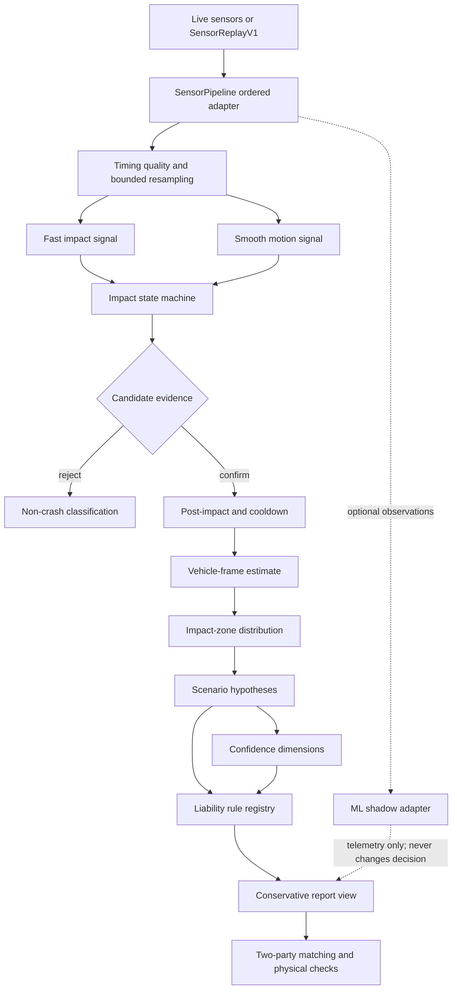

# Strix Algorithm Architecture

## Runtime flow

## Safety boundaries

- Live and replay inputs use the same ordered adapter and monotonic timestamps.
- Recording, profiler, and sensor history buffers are bounded.
- Impact and motion filtering use elapsed time, not fixed sample counts.
- The state machine owns event confirmation; UI state does not make detection decisions.
- Saturated peaks are lower bounds, not precise measurements.
- Vehicle-frame uncertainty widens zone probabilities and limits downstream confidence.
- Scenario inference is separate from identified liability rules.
- Unreviewed liability rules produce ranges and limitations rather than legal certainty.
- Hard physical contradictions reject or clearly reduce two-party matching.
- Remote threshold updates are validated and applied atomically with rollback.
- The optional ML path is shadow-only and falls back to rules-only on every model failure.

## Data and version boundaries

Every replay/report records schema, engine, and threshold versions. A future trained model must additionally record model and feature-schema versions. Privacy-safe research exports remove exact coordinates, absolute start time, and direct account identifiers; labels remain pending until reviewed.

## Main modules

- Replay contracts, recorder, privacy exporter, clock, and player: `lib/replay/`
- Timing and sample-rate normalization: `lib/timing/`
- Signal paths and saturation handling: `lib/signal/`
- Event state machine and non-crash rejection: `lib/impact/`
- Vehicle-frame and phone-movement handling: `lib/orientation/` and `lib/vehicleFrameEstimator.ts`
- Confidence dimensions: `lib/confidence/`
- Scenario inference and liability rules: `lib/scenario/`, `lib/liability/`, and `lib/liabilityEngine.ts`
- Matching and cross-verification: workspace liability package and `lib/accidentSync.ts`
- Performance profiling: `lib/performance/`
- Experimental model adapter: `lib/ml/impactClassifier.ts`
