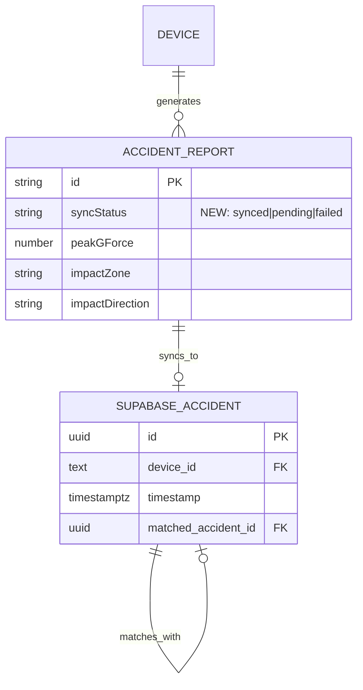

# Data Model: Production Hardening

**Date**: 2026-05-19  
**Branch**: `001-production-hardening`

## Entities

### AccidentReport (Modified)

The existing `AccidentReport` interface in `lib/types.ts` gains one new field:

| Field | Type | Status | Description |
|-------|------|--------|-------------|
| `syncStatus` | `"synced" \| "pending" \| "failed"` | **NEW** | Tracks whether the report was successfully uploaded to Supabase |

**State Transitions**:
```
pending → synced    (upload succeeds)
pending → failed    (upload fails, user notified via Alert)
failed  → pending   (user taps "Retry Sync")
failed  → synced    (retry succeeds)
```

### Supabase `accidents` Table (No Changes)

Current schema is correct and sufficient. Live audit confirmed:

| Column | Type | Nullable | Default |
|--------|------|----------|---------|
| id | uuid | NO | gen_random_uuid() |
| device_id | text | NO | — |
| timestamp | timestamptz | NO | — |
| latitude | float8 | YES | — |
| longitude | float8 | YES | — |
| peak_g_force | float8 | NO | — |
| impact_zone | text | NO | 'unknown' |
| impact_direction | text | NO | 'unknown' |
| speed_kmh | float8 | YES | 0 |
| jerk_peak | float8 | YES | 0 |
| approach_angle | float8 | YES | 0 |
| severity | text | NO | 'moderate' |
| report_json | jsonb | YES | — |
| matched_accident_id | uuid | YES | — |
| match_confidence | float8 | YES | — |
| created_at | timestamptz | YES | now() |

### RLS Policies (No Changes)

| Policy | Role | Command | Condition |
|--------|------|---------|-----------|
| Anyone can insert accidents | public | INSERT | true |
| Read own and matched accidents | public | SELECT | true |
| Update match fields | public | UPDATE | true / true |

### Device Identity (No Changes)

Stored in AsyncStorage under key `@strix_device_id`. Format: `strix_{platform}_{timestamp}_{random}`.

## Relationships



## Validation Rules

1. `syncStatus` defaults to `"pending"` when a report is created.
2. `syncStatus` transitions to `"synced"` only after confirmed Supabase INSERT returns a valid `id`.
3. `syncStatus` transitions to `"failed"` only after a network/RLS error is caught.
4. `device_id` must be initialized via `initDeviceId()` before any report creation. No fallback random generation allowed during active session.
